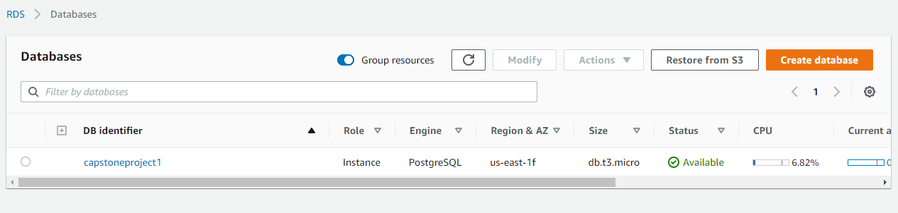
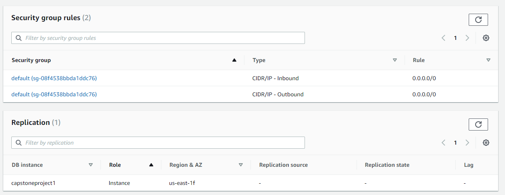
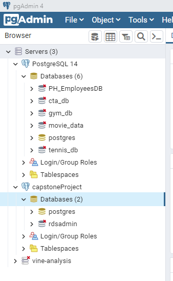

# capstone_project

Link to Project Outline Google Drive https://docs.google.com/document/d/1ZsROYre1mGJZ1bcuoWHezt7zbeNrAfOq_PrLy90I6GE/edit?usp=sharing ; will be deleted after completion of project

Link to Google Slides presentation (including outline for dashboard) https://docs.google.com/presentation/d/1pk2vo9F5P8zRDAE08-awe8mJJhPhlngZq-S5-RuwvW4/edit?usp=sharing

## Project Overview

Topic: Are Chipotles in the Chicago, Illinois region located in "safe" neighborhoods based on zip code, and is crime data a good predictor of target locations for growth?

We are interested in whether Chipotles are located in "safe" neighborhoods because we are considering opening a Chipotle franchise and would like to make sure it is located in the area based on existing locations in Chicago,IL. We are using Chicago as our model city because it's the third largest city in the U.S.A., it has a diverse population, and large metropolitan and suburban areas.

We are hoping to answer:
1. How many Chipotle locations are in "safe" locations?
2. Based on zip code population and crime data, can we predict if the location is viable for a Chipotle location?

Sources of Data:

* Chipotle Locations (https://www.kaggle.com/datasets/jeffreybraun/chipotle-locations)
* Crime and Population Data (https://data.cityofchicago.org/Public-Safety/Crimes-2001-to-Present/ijzp-q8t2)

### Group Dynamic

Communication Protocol:
* Group iMessage for daily touch bases
* Meetings Mondays, Tuesdays, Wednesdays, Thursdays at 7:00PM, adhoc as necessary 

Accountability:
* Each member has their own Github branch to track progress

### Structure 

Main Branch: 
- Resources
  -Data (CSVs)
- ReadMe
-.gitignore 
<<<<<<< HEAD

### Data Outline 

Crime (https://data.cityofchicago.org/Public-Safety/Crimes-2001-to-Present/ijzp-q8t2)

Columns 
* Zip Code (developed by Karla)
* Latitude 
* Longitude
* Primary Type of Crime
    * Crime GPA (average of the binned description)
* FBI Codes

Notes: reduced the data here by 1.1% due to lack of Latitude and Longitude data 
Initial rows of data: 110,952 
Current rows of data: 109,731

Chicago Population Counts (https://data.cityofchicago.org/Health-Human-Services/Chicago-Population-Counts/85cm-7uqa/data)

Columns 

* Zip code 
* Total Population 
    

Chipotle Locations (https://www.kaggle.com/datasets/jeffreybraun/chipotle-locations)

Columns 

* Zip Code (developed by Karla)
* Address
* Lat 
* Lng 

Using Python to convert latitude and longitude from Chipotle data into zip codes in order to link to population and crime data. 

## Database Deliverable

### RDS Database Created

### RDS Database Configuration

### PostGres Connection

=======
>>>>>>> 2260bef2780bc3ddedcce34273054e990922d594
