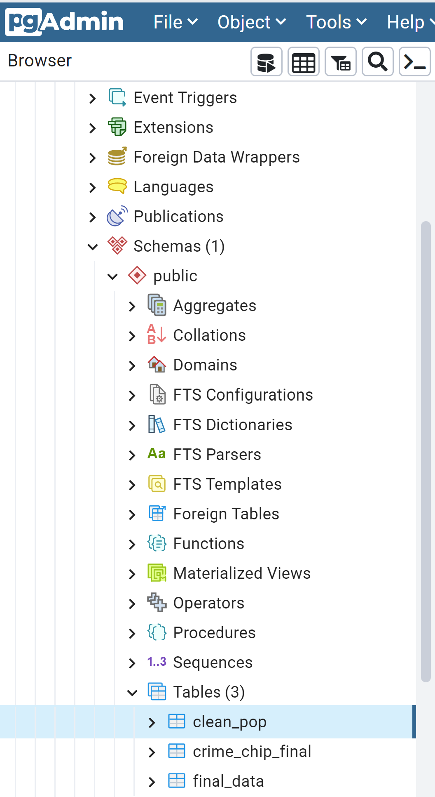
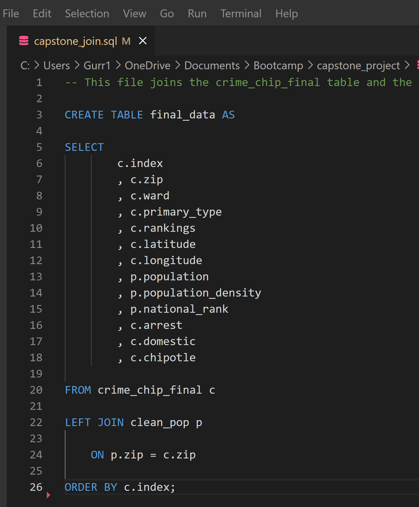

# capstone_project

Link to Project Outline Google Drive https://docs.google.com/document/d/1ZsROYre1mGJZ1bcuoWHezt7zbeNrAfOq_PrLy90I6GE/edit?usp=sharing ; will be deleted after completion of project

Link to Google Slides presentation (including outline for dashboard) https://docs.google.com/presentation/d/1pk2vo9F5P8zRDAE08-awe8mJJhPhlngZq-S5-RuwvW4/edit?usp=sharing

Link to Tableau Dashboard: https://public.tableau.com/views/MetroChicagoChipotlevsCrime/MetroChicagoChipotlevs_Crime?:language=en-US&publish=yes&:display_count=n&:origin=viz_share_link

## Project Overview

Topic: Are Chipotles in the Chicago, Illinois region located in "safe" neighborhoods based on zip code, and is crime data a good predictor of target locations for growth?

We are interested in whether Chipotles are located in "safe" neighborhoods because we are considering opening a Chipotle franchise and would like to make sure it is located in the area based on existing locations in Chicago,IL. We are using Chicago as our model city because it's the third largest city in the U.S.A., it has a diverse population, and large metropolitan and suburban areas.

We are hoping to answer:
1. How many Chipotle locations are in "safe" locations?
2. Based on zip code population and crime data, can we predict if the location is viable for a Chipotle location?

Sources of Data:

* Chipotle Locations (https://www.kaggle.com/datasets/jeffreybraun/chipotle-locations)
* Crime and Population Data (https://data.cityofchicago.org/Public-Safety/Crimes-2001-to-Present/ijzp-q8t2)

### Group Dynamic

Communication Protocol:
* Group iMessage for daily touch bases
* Meetings Mondays, Tuesdays, Wednesdays, Thursdays at 7:00PM, adhoc as necessary 

Accountability:
* Each member has their own Github branch to track progress

### Structure 

Main Branch: 
- Resources
  -Data (CSVs)
- ReadMe
-.gitignore 
<<<<<<< HEAD

### Data Sources 

Crime Data  (https://data.cityofchicago.org/Public-Safety/Crimes-2001-to-Present/ijzp-q8t2)

Columns 
* ID
* Case #
* Date
* Block (address by block)
* IUCR
* Primary Crime Type
* Description of Crime
* Location (Vehicle, Apartment, Street, Residence, etc.)
* Arrest Status
* Domestic Status
* Police Beat
* Police District
* Ward
* Community
* FBI Code
* XCoordinate
* Y Coordinate
* Year
* Last updated
* Latitude 
* Longitude
* Location(lat/long)

Chicago Population data 2020 (https://data.cityofchicago.org/Health-Human-Services/Chicago-Population-Counts/85cm-7uqa/data)

Columns 
* Zip code 
* Location (Lat/Long)
* City with State
* Population
* Population density/Sq.Mile
* National Ranking based on population
    

Chipotle Locations (https://www.kaggle.com/datasets/jeffreybraun/chipotle-locations)

Columns 
* Zip Code
* Address
* Lat
* Lng 

## Database Development

### Data Cleaning 
## Initial evaluations
  - Crime Data is for Chicago 2020 only with 100000 entires
  - A linkage/key is needed to link the crime and population data
    -  Linkage identified as Zip to Ward data
    -  Source: (https://data.cityofchicago.org/Facilities-Geographic-Boundaries/Wards-Zipcodes/fcei-jacx)  
  - Chipotle Data needs zip split out from address field
## Cleaning Process

*Cleaning and intial joins to provide database framework completed in Python with Panda dataframes, and os for joins/merges.  Primary link/key identified as zip to bring the 4 databases together.
  - 2020-Crime
    - Initially eliminated all rows missing lat/lng and location (1.1%).  Noted Added rows back after changing primary key to ward to link to zip.
    - Created severity index for Primary Crime Types
       1-8 point scale consistent with Class X - Class 3 Felonies and Class A/1 to C/3 Misdemeanors. Level 8 represents highest severity crimes: murder, criminal crimes against children, Armed Robbery, Terrorist threats, and solicition for murder. Level 1 represents lowest severity misdemeanor offenses: petty theft, simple assult, evading police, vandalism, cyber bullying, minor possession, child welfare.
   

* Linkages/Merges completed in python:
  - 2020_Crime.csv to Ward_Zip.csv
  - Crime_Zip_df to Chicago_Population_by Zipcode_2020.csv
  - For intial model prototype database: .csv to New_Chipotle_Data

* Changes made for modeling purposes
  - Changed Arrest and Domestic columns from True/False to Binary 1/0
  - Changed Chipotle location in Zip from Yes to Binary 1/0
  - Converted National rank from # and the number rank to numeric only.

* Fields maintained for model: Zip, Ward, Primary_Type, Latitude and Longitude of incident, Arrest status (binary 1=yes), Domstic Status (binary 1=yes), Population, People/Sq.Mile, National_rank, chipotle (binary 1=yes), Safety - (1-3 ranking reflects safe, binary yes = 1) 
     

## Machine Learning Deliverable 
#### Description of data preprocessing

*	In our preprocessing, the only thing we changed was converting ‘Arrest’ and ‘Domestic’ columns into ones and zeros and not encoding the other ‘object’ type columns. In our csv file, we also adjusted the ‘Safety’ ratings by increasing range of ‘safe’ including misdemeanors (rankings of 3 or below).
#### Description of feature engineering and feature selection, including the team’s decision-making process 

*	Because we introduced our own ranking system, we determined that encoding our dataset was not necessary. We also used StandardScaler to normalize the data. For our feature selection, we filtered out more unnecessary columns. Specifically, we removed, ‘Population’, ‘Latitude’, ‘Longitude’, and ‘Ward’. 
#### Description of how data was split into training and testing sets
*	In our original model, we split the dataset using the default settings of 75% training and 25% testing. In our neural network, we split our dataset into 70% training and 30% testing. We also included a Shuffle parameter data to address the imbalance of safe/unsafe.
#### Explanation of model choice, including limitations and benefits. 
*	We changed from supervised machine learning models to a deep learning model.
*	The main benefits of neural network are that it is flexible and can be used for both regression and classification problems and works best with lot of data points.
*	One problem of neural network is that it is prone to overfitting. Adding too much nodes and hidden layer will overtrain our model. Additionally, it is also computationally very expensive and time consuming to train models.
Explanation of changes in model choice (if changes occurred between the Segment 2 and Segment 3 deliverables)
*	We changed the model from supervised machine learning to deep learning because computationally it is not as taxing and it is able to train better with more data points.
#### Description of how model was trained (or retrained, if they are using an existing model)

*	In our first hidden layer we added two to three times the number of nodes as input features. With six input features, we put 15 nodes in the first hidden layer and 10 layers in the second hidden layer. Additionally, we added a dropout layer to prevent overfitting. In our hidden layers we also using ‘relu’ activation function and ‘sigmoid’ activation function in our output layer. These activation functions were used because they are commonly used in classification problems. To train the model, we increased the batch size during the fitting process to hyper train our model and then lowered it at our final training. Finally, we lowered the epoch from 100 to 50.
#### Description and explanation of model’s confusion matrix, including final accuracy score

*	With the deep neural network model, we have an accuracy of 98.5%. Our model predicts whether the presence of chipotle is determined by crime and population demographic data.

## Database Deliverable

### RDS Database Created

### PostGres Connected Database

### Entity Relationship Diagram

### SQL Join

=======
>>>>>>> 2260bef2780bc3ddedcce34273054e990922d594
